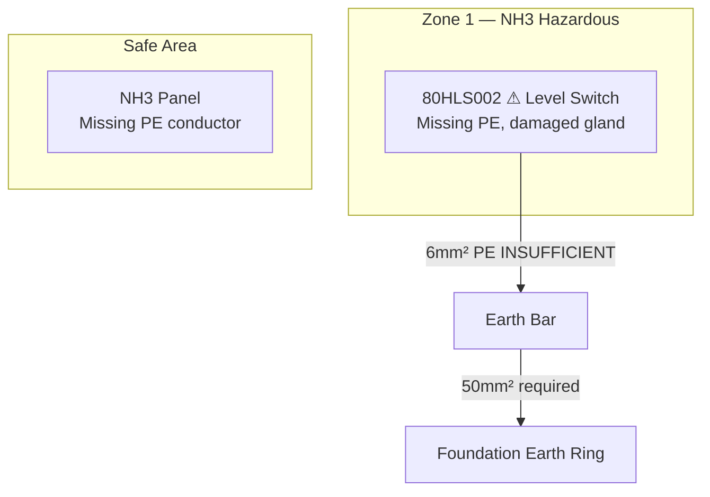

## Summary
The inspection was conducted on an 80 NH3 plant at an unspecified location, with the project number and customer not explicitly mentioned. The inspection took place on a specific date, and the inspector's name was not provided. The overall result indicated several deviations and required actions to ensure compliance with relevant standards and regulations.

## Background
- Customer: Not specified
- Location: Not specified
- Project Number: Not specified
- Inspector: Not specified
- Date: Not specified
- Zone classification source: Not specified
- P&ID reference: Not specified

## Standarder og Krav
The following standards and directives were mentioned:
- DS/EN 60079-14:2024 (Electrical installations in hazardous areas)
- DS/EN 60079-17:2017 (Inspection and maintenance of electrical installations in hazardous areas)
- DS/EN 60204-1: Safety of machinery - Electrical equipment of machines
- ATEX Directive 2014/34/EU
- Machine Directive 2006/42/EU
- DS/HD IEC 60364 (Installationsbekendtgørelsen)
- DS/EN ISO 20607:2019
- DS/EN IEC/IEEE 82079-1:2020

## Technical Specifications
- Protective bonding between metallic pipe bridge and concrete foundation must be ≥ 16 mm² (or 50 mm² if considered a down conductor per DS/EN 62305-3 chapter 6.2.2).
- EX ratings:
  - Zone 0: EX II 1G IIA Ga minimum
  - Zone 1: EX II 2G IIA T1 Gb minimum
  - Zone 2: EX II 3G IIA T1 Gc minimum
- IP ratings required per enclosure type: Not specified
- Temperature classes: T1-T6
- Gas groups: IIA/IIB/IIC
- Transient protection discharge capacity: Not specified in kA
- Specific tool requirements for Ex d glands: Correct open-ended spanners.

## Best Practices
- EX d glands must only be tightened with correct open-ended spanners — NEVER grip-tongs or pipe wrenches which create burrs and destroy flameproof integrity per DS/EN 60079-1.
- Unused cores in EX zone cables must be terminated in a fixed terminal block or isolated with heat-shrink tubing — loose wire nuts and Wago connectors are strictly prohibited in EX zones.
- Every EX instrument must have a dedicated Green/Yellow PE core — relying on cable armour or braid screen alone is insufficient and non-compliant.

## Known Pitfalls
| Pitfall | TAG | Exact Finding | Standard Clause | Specific Fix |
| --- | --- | --- | --- | --- |
| Missing/ Insufficient PE | 80HLS002 | Missing PE, damaged gland | DS/EN 60079-14 | Verify PE bonding conductor ≥16mm² on pipe bridge, Confirm 50mm² if conductor acts as down-conductor |
| Incorrect Shielding | 80P001 | Incorrect installation of shielding in instrument cables | DS/EN 60079-14 | Isolate shielding in instrument cables |
| Damaged Cable Glands | 80HLS002 | Damaged cable glands on explosion-protected equipment | DS/EN 60079-1 | Replace damaged cable glands on explosion-protected equipment |
| Uninsulated Screens | - | Uninsulated screens in instrumentation cables | DS/EN 60079-14 | Insulate screens in instrumentation cables |
| Loose Sample Sleeves | - | Loose sample sleeves in explosion-protected equipment | DS/EN 60079-14 | Remove loose sample sleeves in explosion-protected equipment |

## Mermaid Diagram

## Checklist
- [ ] Verify PE bonding conductor ≥16mm² on pipe bridge
- [ ] Confirm 50mm² if conductor acts as down-conductor
- [ ] EX d glands tightened with open-ended spanner only
- [ ] All unused cores terminated or isolated with heat-shrink
- [ ] Every EX instrument has dedicated G/Y PE core
- [ ] All TAG numbers labelled before inspection
- [ ] Zone classification matches installed equipment category
- [ ] Lightning protection documented in el-technical docs

## Lessons Learned
- Root cause: Inadequate installation and inspection procedures.
- Actual cost or time impact: Not specified.
- Prevention rule: Regular inspections and adherence to standards.

## Evidence Links
- 80HLS002: 

## Referencer
- All TAG numbers found with their faults: 80HLS002, 80P001, 80HE001, 80HE002
- All cable cross-sections in mm²: 6mm², 16mm², 50mm²
- All terminal block references: Not specified
- Zone classifications with gas group and temperature class: Not specified
- All required actions with priority: Not specified
- Project number, customer, inspector, date: Not specified