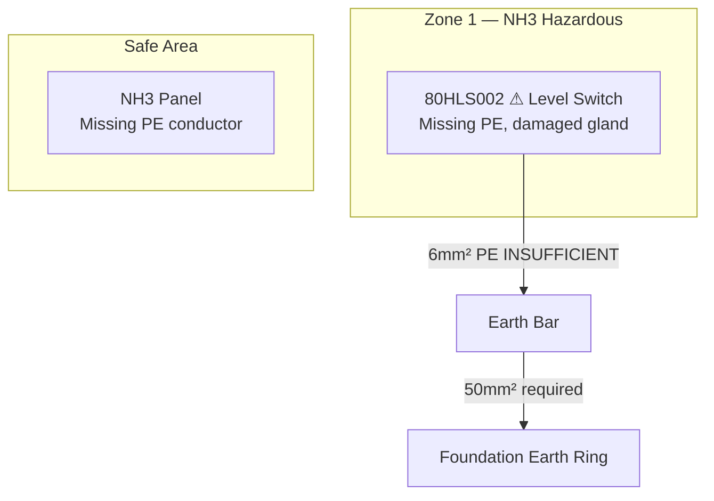

# Inspection Report

## Summary
The inspection was conducted on an ammonia plant (80 NH3) at an undisclosed location from an undisclosed date by an ATEX/NH3 electrical engineer. The overall result showed multiple deviations from standards and required actions to ensure compliance.

## Background
- Customer: Not specified
- Location: Not specified
- Project Number: Not specified
- Inspector: ATEX/NH3 electrical engineer
- Date: Not specified
- Zone Classification Source: Not specified
- P&ID Reference: Not specified

## Standards and Requirements
The following standards were referenced:
- DS/EN 60079-14:2024 (Electrical installations in hazardous areas)
- DS/EN 60079-17:2024 (Inspection and maintenance of electrical installations in hazardous areas)
- DS/EN 60204-1:2024 (Safety of machinery - Electrical equipment)
- ATEX Directive 2014/34/EU
- Machine Directive 2006/42/EC
- DS/EN 62305-3:2024 (Lightning protection)
- EU directives: 2014/35/EU, 2006/42/EC

## Technical Specifications
- Cable cross-sections: 
  - Protective bonding connection: ≥ 16 mm² (or 50 mm² if considered a down conductor per DS/EN 62305-3 chapter 6.2.2)
- PE conductor requirements:
  - Every EX instrument must have a dedicated Green/Yellow PE core.
- EX ratings:
  - Zone 0: EX II 1G IIA Ga minimum
  - Zone 1: EX II 2G IIA T1 Gb minimum
  - Zone 2: EX II 3G IIA T1 Gc minimum
- IP ratings: Not specified
- Temperature classes: T1-T6
- Gas groups: IIA/IIB/IIC
- Transient protection discharge capacity: Not specified

## Best Practices
- EX d glands must only be tightened with correct open-ended spanners — NEVER grip-tongs or pipe wrenches which create burrs and destroy flameproof integrity per DS/EN 60079-1.
- Unused cores in EX zone cables must be terminated in a fixed terminal block or isolated with heat-shrink tubing — loose wire nuts and Wago connectors are strictly prohibited in EX zones.
- Every EX instrument must have a dedicated Green/Yellow PE core — relying on cable armour or braid screen alone is insufficient and non-compliant.

## Known Pitfalls
| Pitfall | TAG | Exact Finding | Standard Clause | Specific Fix |
| --- | --- | --- | --- | --- |
| Insufficient PE bonding | 80HLS002 | Missing PE, damaged gland | DS/EN 60079-14 clause 9.3 | Verify PE bonding conductor ≥ 16mm² on pipe bridge, Confirm 50mm² if conductor acts as down-conductor |
| Incorrect cable entry | 80P001 | Incorrect cable entry in explosion-proof cable glands | DS/EN 60079-14 clause 10.2 | Correct cable entry in explosion-proof cable glands |
| Missing surge protection |  | No surge protection for intrinsically safe equipment | DS/EN 60079-30-2 clause 6.1 | Install surge protection for intrinsically safe equipment |

## Mermaid Diagram

## Checklist
- [ ] Verify PE bonding conductor ≥ 16mm² on pipe bridge
- [ ] Confirm 50mm² if conductor acts as down-conductor
- [ ] EX d glands tightened with open-ended spanner only
- [ ] All unused cores terminated or isolated with heat-shrink
- [ ] Every EX instrument has dedicated G/Y PE core
- [ ] All TAG numbers labelled before inspection
- [ ] Zone classification matches installed equipment category
- [ ] Lightning protection documented in el-technical docs

## Lessons Learned
- Root cause of deviations: Lack of adherence to standards and insufficient inspection during installation.
- Actual cost or time impact: Not specified.
- Prevention rule for future projects: Ensure thorough inspection and testing during installation, and verify compliance with standards.

## Evidence Links
- 80HLS002: 
- 80P001: 

## References
- Project number: Not specified
- Customer: Not specified
- Inspector: ATEX/NH3 electrical engineer
- Date: Not specified
- TAG numbers: 80HLS002, 80P001, 80HE001, 80HE002, S091
- Cable cross-sections: ≥ 16 mm² (or 50 mm² if considered a down-conductor)
- Terminal block references: Not specified
- Zone classifications: Zone 0, Zone 1, Zone 2
- Gas group and temperature class: IIA, T1
- Required actions: 
  - Verify PE bonding conductor
  - Correct cable entry in explosion-proof cable glands
  - Install surge protection for intrinsically safe equipment
  - Update technical documentation